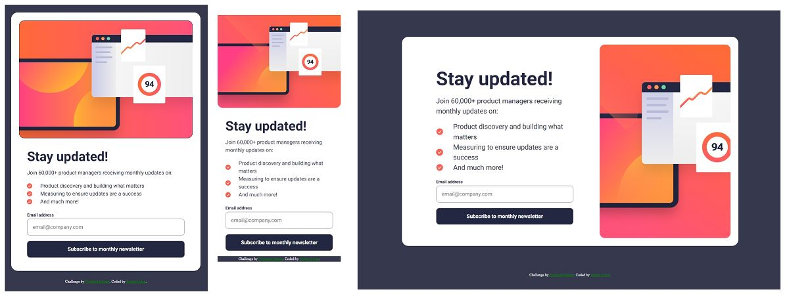
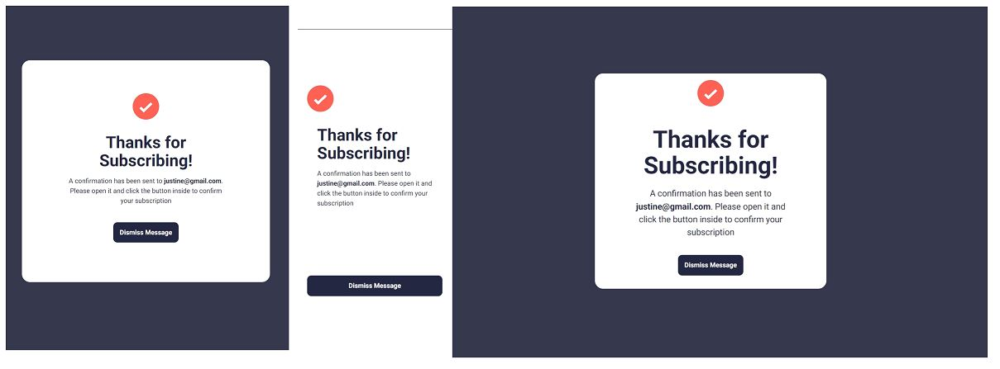

# Frontend Mentor - Newsletter sign-up form with success message solution

This is a solution to the [Newsletter sign-up form with success message challenge on Frontend Mentor](https://www.frontendmentor.io/challenges/newsletter-signup-form-with-success-message-3FC1AZbNrv). Frontend Mentor challenges help you improve your coding skills by building realistic projects. 

## Table of contents

- [Overview](#overview)
  - [The challenge](#the-challenge)
  - [Screenshot](#screenshot)
  - [Links](#links)
- [My process](#my-process)
  - [Built with](#built-with)
  - [What I learned](#what-i-learned)
- [Author](#author)

## Overview

The challenge is to build out this newsletter form and get it looking as close to the design as possible and add some
javascript DOM manipulation.

### The challenge

Users should be able to:

- Add their email and submit the form
- See a success message with their email after successfully submitting the form
- See form validation messages if:
  - The field is left empty
  - The email address is not formatted correctly
- View the optimal layout for the interface depending on their device's screen size
- See hover and focus states for all interactive elements on the page

### Screenshot

### Links

- Solution URL: [Add solution URL here](https://your-solution-url.com)
- Live Site URL: [Add live site URL here](https://your-live-site-url.com)

## My process

My web development process starts with semantic HTML to build a clear, meaningful structure, then I add content like text and images so the page feels real. Next, I handle layout with CSS, usually mobile-first, followed by styling—colors, fonts, and visuals to make it look good. Finally, I add JavaScript for interactivity, like clicks and dynamic updates. This step-by-step approach keeps my sites organized, responsive, and easy to maintain.

### Built with

- Semantic HTML5 markup
- CSS custom properties
- Flexbox
- Mobile-first workflow
- Sass
- Javascript

### What I learned

I learned JavaScript DOM manipulation to change page content dynamically, and local storage to save data in the browser. I also practiced passing parameters between functions and styling elements with JavaScript. These skills let me make my pages more interactive and responsive.

## Author

- Frontend Mentor - [@Jsync2](https://www.frontendmentor.io/profile/yourusername)
- Twitter - [@jsync2](https://www.twitter.com/yourusername)
